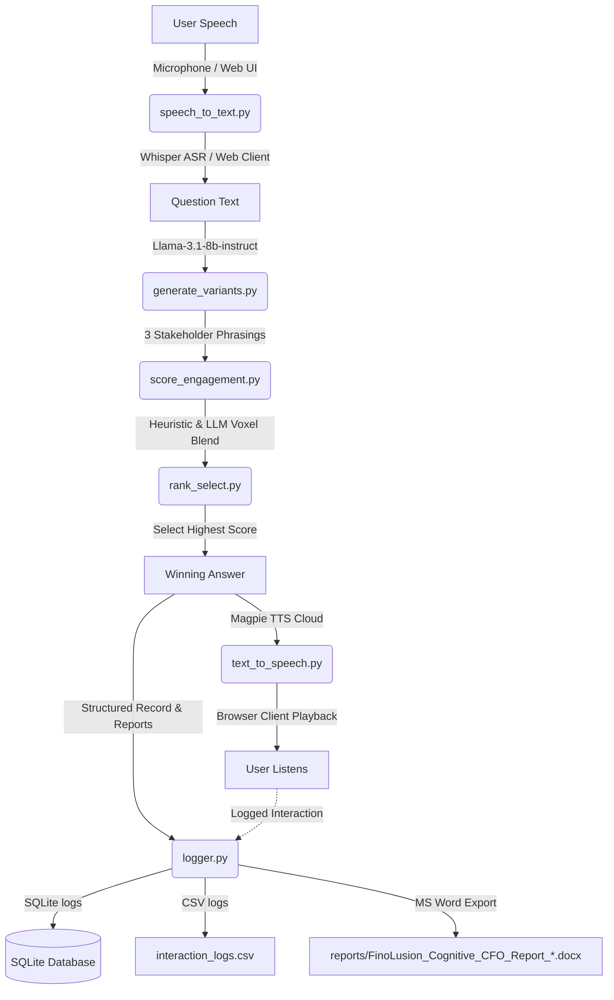

# FinoLusion Cognitive CFO OS: Neuro-Linguistic Engagement & fMRI Cortical Simulation

An interactive, B2B FinTech voice-activated system that records user queries, generates three stakeholder-focused phrasing variants of the answer, scores them using a brain-encoding simulator inspired by Meta's TRIBE v2 framework, visualizes predicted fMRI activations on 3D lateral cortical brain maps, and exports premium Word reports (.docx) alongside local SQLite logging.

---

## Architecture Flow



---

## Key Features

1. **Interactive Web Dashboard (`app.py`)**: A gorgeous, dark-themed FastAPI web application with a dual Voice/Text input channel, a timeline step-by-step loading animation, real-time metric graphs, and interactive 3D fMRI lateral brain maps.
2. **Three Stakeholder-Focused Phrasings (`generate_variants.py`)**: Uses NVIDIA-hosted Llama-3.1-8b-instruct to generate three detailed phrasings targeting different stakeholders:
   - **Variant 1 (Analytical / CFO Focus)**: Highlights data, numbers, liquidity, and risk/compliance controls.
   - **Variant 2 (Strategic / CEO Focus)**: Emphasizes high-level business scalability, strategic growth, and peace of mind.
   - **Variant 3 (Operational / Controller Focus)**: Focuses on execution speed, ease of integration, and workflow results.
3. **TRIBE v2 Brain-Encoding Simulator (`score_engagement.py`)**: Computes a 4D simulated cortical activation vector based on Meta's TRIBE v2 framework:
   - **PFC (Prefrontal Cortex)**: Models logic, structural complexity, and readability.
   - **Amygdala**: Models emotional valence and expressive keywords.
   - **Temporal (Auditory/Broca)**: Evaluates cadence, rhythm, and phonetic flow.
   - **NAcc (Nucleus Accumbens)**: Models attention hook and reward anticipation.
4. **3D Cortical Surface Plotting (Nilearn)**: Renders lateral projections (left and right views) of predicted neural activations mapping region scores to the `fsaverage5` standard brain surface mesh, saving high-resolution heatmaps.
5. **Executive Word Reports (`logger.py`)**: Generates professional, branded corporate executive `.docx` reports containing:
   - Dynamic user-question header blocks.
   - A fully justified, padded leaderboard table with exact scores and brain region percentages (never wrapping numbers).
   - Inline 3D cortical fMRI brain maps.
   - Dynamic, plain-English executive analysis paragraphs explaining the cognitive results.

---

## File Structure

```
├── app.py                # FastAPI web server and interactive dashboard frontend.
├── config.py             # Global configurations, model models, and brain-region weights.
├── speech_to_text.py     # Captures audio from mic (15s) and transcribes via Whisper.
├── generate_variants.py  # Generates 3 stakeholder variants using Llama-3.1.
├── score_engagement.py   # Runs fMRI scoring, Nilearn plotting, and mock fallbacks.
├── rank_select.py        # Leaderboard sorter and winner selection engine.
├── text_to_speech.py     # Synthesizes selected winning text to audio via Magpie-TTS.
├── logger.py             # Interfaces voice_agent.db, CSV logging, and Word reports.
├── main.py               # Legacy orchestrator for command-line CLI execution.
├── requirements.txt      # Dependency specification list.
├── .gitignore            # Excludes local audio recordings, databases, and credential files.
├── data/                 # Directory holding audio logs, cache, and 3D surface templates.
└── reports/              # Branded executive MS Word report files.
```

---

## Setup & Installation

### Prerequisites
- **Python 3.11**
- macOS (includes native `afplay` for fallback local audio playback).
- PortAudio library (required for `sounddevice` microphone capture). If missing, run:
  ```bash
  brew install portaudio
  ```

### Install Dependencies
Run:
```bash
pip install -r requirements.txt
```

### Environment Configuration
Create a `.env` file in the root folder:
```env
NVIDIA_API_KEY=nvapi-YOUR_NVIDIA_API_KEY_HERE
```
*If no API key is specified, the application falls back gracefully to local text-input mode, mock variant generation, local heuristics scoring, and local text-to-speech fallback.*

---

## How to Run

### 1. Launch the Interactive Web App (Recommended)
Boot the FastAPI application:
```bash
python app.py
```
Then navigate to **[http://127.0.0.1:8000](http://127.0.0.1:8000)** in your browser to access the complete Voice/Text fMRI dashboard!

### 2. Run the Command-Line CLI
Run the terminal voice recording loop (records for 15 seconds):
```bash
python main.py
```
*Options:*
- `python main.py --text` — Skip mic and type question in the terminal.
- `python main.py --duration 15` — Capture audio for 15 seconds (default).
- `python main.py --no-play` — Process and log the query silently.
