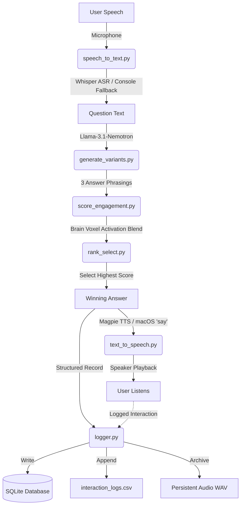

# TRIBE v2-Inspired Voice Agent Pipeline

A voice-activated agent pipeline that captures spoken questions, generates three distinct phrasings of the answer using an LLM, scores each phrasing for predicted engagement based on a brain-encoding simulator inspired by Meta's TRIBE v2 framework, selects the highest-scoring version, speaks it back to the user, and logs everything to a local database and CSV sheet.

---

## Architecture Flow



---

## Pipeline Components

1. **Speech-to-Text (`speech_to_text.py`)**: Uses the `sounddevice` and `soundfile` libraries to capture high-quality audio from the user's default microphone, then sends it to NVIDIA's cloud-hosted Whisper-Large-v3 endpoint (`/v1/audio/transcriptions`) for instant transcription. Falls back gracefully to console keyboard entry if no microphone is found or the API key is not configured.
2. **Answer Generation (`generate_variants.py`)**: Submits the transcribed question to NVIDIA's Llama-3.1-Nemotron-70B model to generate a correct factual answer rendered in exactly 3 distinct styles:
   - **Variant 1**: Direct, concise, and structured (standard assistant).
   - **Variant 2**: Engaging, conversational, and high-energy.
   - **Variant 3**: Detailed, educational, and professional.
3. **Scoring Module (`score_engagement.py`)**: A cognitive engagement scoring system inspired by Meta's **TRIBE v2** multimodal brain-encoding framework. It computes a 4D simulated cortical region activation vector representing a listener's brain response:
   - **PFC (Prefrontal Cortex)**: Measures cognitive clarity, depth, and processing structure.
   - **Amygdala**: Models emotional resonance, valence, and expressive intensity.
   - **Temporal Lobe**: Evaluates auditory cadence, phonetic flow, and pronounceability.
   - **Nucleus Accumbens (NAcc)**: Simulates attention hook, curiosity reward, and satisfaction.
   *Fuses local heuristic evaluations (readability indexes, sentiment word density, phoneme flow metrics) with an optional LLM brain emulation prompt to simulate voxel responses.*
4. **Ranking & Selection (`rank_select.py`)**: Sorts the responses by the computed TRIBE v2 score, prints a visual leaderboard in the terminal comparing the alternatives, and selects the winning phrasing.
5. **Text-to-Speech (`text_to_speech.py`)**: Synthesizes the selected winner using NVIDIA's Magpie-TTS API (`/v1/audio/speech`). Saves it as a local WAV file and plays it back out loud. On macOS, if the API key is not provided, it falls back to the native `say` utility.
6. **Logging and Archiving (`logger.py`)**: Archives the generated playback audio into a persistent folder (`data/audio_records/`) and registers the timestamp, original question, all 3 variants with their raw activations, the selected phrasing, and the archived audio path to an SQLite database (`data/voice_agent.db`) and a spreadsheet-friendly CSV log (`data/interaction_logs.csv`).

---

## Setup & Installation

### Prerequisites
- **Python 3.11**
- macOS (includes native audio playback `afplay` and built-in synthesizer `say`).
- PortAudio library (usually pre-loaded on macOS; required for `sounddevice`). If missing, install via Homebrew:
  ```bash
  brew install portaudio
  ```

### Install Python Dependencies
Run the following command to install the required libraries:
```bash
pip install -r requirements.txt
```

### Environment Configuration
1. Obtain an API Key from the [NVIDIA API Catalog](https://build.nvidia.com/).
2. Create a `.env` file in the root folder of this project:
   ```env
   NVIDIA_API_KEY=nvapi-YOUR_NVIDIA_API_KEY_HERE
   ```
   *If no API key is specified, the pipeline operates in offline fallback mode (keyboard text inputs, local heuristics for brain-activity scoring, mock responses, and macOS's built-in speech engine).*

---

## How to Run

### 1. Default Voice Pipeline (Microphone + TTS)
Run the script to record a question from your microphone (default is 5 seconds) and get spoken responses:
```bash
python main.py
```

### 2. Manual Keyboard Input Mode (Skip Microphone)
Skip recording and type your question directly in the console. Excellent for headless servers or environments where mic permissions are disabled:
```bash
python main.py --text
```

### 3. Adjust Recording Duration
Record a longer question (e.g. 8 seconds):
```bash
python main.py --duration 8
```

### 4. Silent Testing Mode
Perform ASR, generate responses, score them, and log them, but skip speaking the audio back:
```bash
python main.py --no-play
```

---

## File Structure

```
├── config.py             # Stores models, paths, weights, and audio configurations.
├── speech_to_text.py     # records voice input and manages ASR transcriptions.
├── generate_variants.py  # Generates 3 answer phrasings using Llama-3.1-Nemotron.
├── score_engagement.py   # Calculates 4-region brain-encoding activations.
├── rank_select.py        # Compares variants and determines the winner.
├── text_to_speech.py     # Synthesizes selected text to audio and plays it.
├── logger.py             # Interfaces SQLite database and CSV file writing.
├── main.py               # Orchestrator running the 6-step loop.
├── requirements.txt      # Dependency specification.
└── data/                 # Auto-created directory for database, logs, and audio recordings.
```
